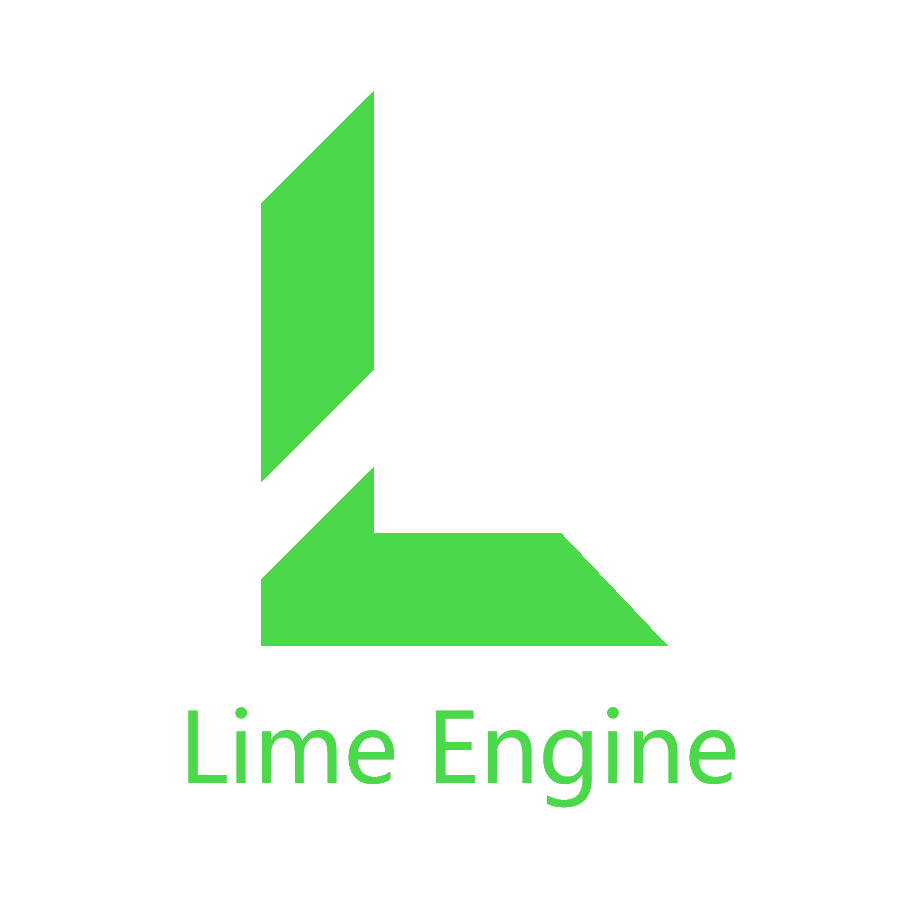

Lime is a first attempt of building a java game library lots of the knowledge used is from
the https://www.youtube.com/@TheCherno.
It is my interpretation from his C++ code that I translated to java code.